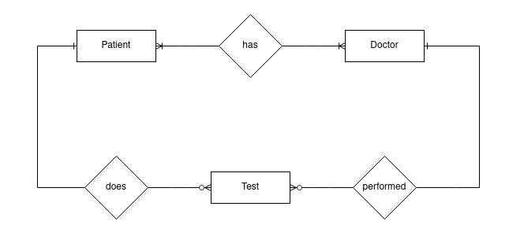

# Simple hospital API made with NestJS and DynamoDB

Simple hospital API made to demonstrate DynamoDB capabilities.

## Things demonstrated

- DynamoDB data modeling
  - Single Table Design
  - One-to-many relationships
  - Many-to-many relationships
  - Cross-partition querying
  - Pagination and Sorting strategies
  - Singleton strategy
  - Incomplete migration helper and some more interesting stuff :)
- NestJS
- Vertical slice architecture
- CQS

## Running locally

> **Prerequisites**: This example requires only node and docker installed.

## ERD

A very simple ERD was used for this project. However, it was more than enough to demonstrate a lot of different DynamoDB concepts based on the access patterns.

## Entities

Initial entities included:

- Doctor
- Patient
- Test

which was obvious from the ERD.
As different access patterns were modeled two more entities were added:

- DoctorPatient - to address many-to-many relationship between Doctors and Patients
- Specialization - singleton that has a set of all medical departments in a hospital

## Entity chart

Entity chart is used to keep track of all the different item types that we are going to store in our table.

<table>
  <thead>
    <tr>
      <th>ENTITY</th>
      <th>PK</th>
      <th>SK</th>
    </tr>
  </thead>
  <tbody>
    <tr>
      <td>Patient</td>
      <td>PATIENT#&lt;PatientId&gt;</td>
      <td>PATIENT#&lt;PatientId&gt;</td>
    </tr>
    <tr>
      <td>Doctor</td>
      <td>DOCTOR#&lt;DoctorId&gt;</td>
      <td>DOCTOR#&lt;DoctorId&gt;</td>
    </tr>
    <tr>
      <td>Test</td>
      <td>PATIENT#&lt;PatientId&gt;</td>
      <td>#TEST#&lt;KSUID&gt;</td>
    </tr>
    <tr>
      <td>Specialization</td>
      <td>DOCTOR</td>
      <td>SPECIALIZATION</td>
    </tr>
    <tr>
      <td>DoctorPatient</td>
      <td>DOCTOR#&lt;DoctorId&gt;</td>
      <td>PATIENT#&lt;PatientId&gt;</td>
    </tr>
  </tbody>
</table>

## Access patterns

<table border="1">
  <thead>
    <tr>
      <th>ENTITY</th>
      <th>ACCESS PATTERN</th>
      <th>INDEX</th>
      <th>PARAMS</th>
      <th>NOTES</th>
    </tr>
  </thead>
  <tbody>
    <tr>
      <td rowspan="7">Patient</td>
      <td>Get</td>
      <td>/</td>
      <td>pk: PATIENT#&lt;PatientId&gt; sk: PATIENT#&lt;PatientId&gt;</td>
      <td>/</td>
    </tr>
    <tr>
      <td>List - sort by created time</td>
      <td>GSI2</td>
      <td>pk: PATIENT#&lt;TRUNC_TO_WEEK(CreatedAt)&gt; sk: PATIENT#&lt;CreatedAt&gt;</td>
      <td>We get 100 new patients weekly</td>
    </tr>
    <tr>
      <td>List - sort by lastname</td>
      <td>GSI1</td>
      <td>pk: PATIENT#&lt;TRUNC(LastName)&gt; sk: PATIENT#&lt;LastName-CreatedAt&gt;</td>
      <td>/</td>
    </tr>
    <tr>
      <td>Create</td>
      <td>/</td>
      <td>pk: PATIENT#&lt;PatientId&gt; sk: PATIENT#&lt;PatientId&gt;</td>
      <td>/</td>
    </tr>
    <tr>
      <td>Update</td>
      <td>/</td>
      <td>pk: PATIENT#&lt;PatientId&gt; sk: PATIENT#&lt;PatientId&gt;</td>
      <td>/</td>
    </tr>
    <tr>
      <td>Delete</td>
      <td>/</td>
      <td>pk: PATIENT#&lt;PatientId&gt; sk: PATIENT#&lt;PatientId&gt;</td>
      <td>/</td>
    </tr>
    <tr>
      <td>List of Patients for a specific Doctor</td>
      <td>GSI3</td>
      <td>pk: PATIENT#&lt;PatientId&gt; sk: DOCTOR#&lt;DoctorId&gt;</td>
      <td>/</td>
    </tr>
    <tr>
      <td rowspan="6">Doctor</td>
      <td>Get</td>
      <td>/</td>
      <td>pk: DOCTOR#&lt;DoctorId&gt; sk: DOCTOR#&lt;Specialization&gt;</td>
      <td>/</td>
    </tr>
    <tr>
      <td>List - sort and filter by specialization</td>
      <td>GSI2</td>
      <td>pk: SPECIALIZATION#&lt;Specialization&gt; sk: &lt;Specialization&gt;#&lt;DoctorId&gt;</td>
      <td>Cross-partition query of doctors. Sort in order of alphabetically sorted specializations.</td>
    </tr>
    <tr>
      <td>Create</td>
      <td>/</td>
      <td>pk: DOCTOR#&lt;DoctorId&gt; sk: DOCTOR#&lt;DoctorId&gt;</td>
      <td>/</td>
    </tr>
    <tr>
      <td>Update</td>
      <td>/</td>
      <td>pk: DOCTOR#&lt;DoctorId&gt; sk: DOCTOR#&lt;DoctorId&gt;</td>
      <td>/</td>
    </tr>
    <tr>
      <td>Delete</td>
      <td>/</td>
      <td>pk: DOCTOR#&lt;DoctorId&gt; sk: DOCTOR#&lt;DoctorId&gt;</td>
      <td>/</td>
    </tr>
    <tr>
      <td>List Doctors for specific Patient</td>
      <td>GSI3</td>
      <td>pk: PATIENT#&lt;PatientId&gt; sk: DOCTOR#&lt;DoctorId&gt;</td>
      <td>/</td>
    </tr>
    <tr>
      <td rowspan="4">Test</td>
      <td>Get test for patient</td>
      <td>/</td>
      <td>pk: PATIENT#&lt;PatientId&gt; sk: #TEST#&lt;KSUID&gt;</td>
      <td>/</td>
    </tr>
    <tr>
      <td>Create test for patient</td>
      <td>/</td>
      <td>pk: PATIENT#&lt;PatientId&gt; sk: #TEST#&lt;KSUID&gt;</td>
      <td>/</td>
    </tr>
    <tr>
      <td>List tests for patient</td>
      <td>/</td>
      <td>pk: PATIENT#&lt;PatientId&gt; sk: #TEST#&lt;KSUID&gt;</td>
      <td>/</td>
    </tr>
    <tr>
      <td>List tests performed by specific doctor</td>
      <td>GSI1</td>
      <td>pk: DOCTOR#&lt;DoctorId&gt; sk: #TEST#&lt;KSUID&gt;</td>
      <td>GSI1 is added to both doctors and tests</td>
    </tr>
    <tr>
      <td rowspan="2">Specialization</td>
      <td>Get</td>
      <td>/</td>
      <td>pk: DOCTOR sk: SPECIALIZATION</td>
      <td>Specialization is a singleton item that has a set of all possible specializations in a hospital</td>
    </tr>
    <tr>
      <td>Add new</td>
      <td>/</td>
      <td>pk: DOCTOR sk: SPECIALIZATION</td>
      <td>Adding simply adds to the singleton's set</td>
    </tr>
    <tr>
      <td rowspan="2">DoctorPatient</td>
      <td>Assign Doctor to Patient</td>
      <td>/</td>
      <td>pk: DOCTOR#&lt;DoctorId&gt; sk: PATIENT#&lt;PatientId&gt;</td>
      <td>Many-to-many rel for doctors and patients, uses GSI3</td>
    </tr>
    <tr>
      <td>Remove patient from doctor</td>
      <td>/</td>
      <td>pk: DOCTOR#&lt;DoctorId&gt; sk: PATIENT#&lt;PatientId&gt;</td>
      <td>/</td>
    </tr>
  </tbody>
</table>

## GSI1 TABLE

<table>
  <thead>
    <tr>
      <th>ENTITY</th>
      <th>GSI1PK</th>
      <th>GSI1SK</th>
    </tr>
  </thead>
  <tbody>
    <tr>
      <td>Doctor</td>
      <td>DOCTOR#&lt;DoctorId&gt;</td>
      <td>DOCTOR#&lt;DoctorId&gt;</td>
    </tr>
    <tr>
      <td>Test</td>
      <td>DOCTOR#&lt;DoctorId&gt;</td>
      <td>#TEST#&lt;KSUID&gt;</td>
    </tr>
    <tr>
      <td>Patient</td>
      <td>PATIENT#&lt;TRUNC(LastName)&gt;</td>
      <td>PATIENT#LAST_NAME)&gt;</td>
    </tr>
  </tbody>
</table>

## GSI2 TABLE

<table>
  <thead>
    <tr>
      <th>ENTITY</th>
      <th>GSI2PK</th>
      <th>GSI2SK</th>
    </tr>
  </thead>
  <tbody>
    <tr>
      <td>Patient</td>
      <td>PATIENT#&lt;TRUNC(WEEK)&gt;</td>
      <td>PATIENT#CREATED_AT</td>
    </tr>
    <tr>
      <td>Doctor</td>
      <td>SPECIALIZATION#&lt;Specialization&gt;</td>
      <td>&lt;Specialization&gt;#&lt;DoctorId&gt;</td>
    </tr>
  </tbody>
</table>

## GSI3 TABLE

<table>
  <thead>
    <tr>
      <th>ENTITY</th>
      <th>GSI3PK</th>
      <th>GSI3SK</th>
    </tr>
  </thead>
  <tbody>
    <tr>
      <td>Patient</td>
      <td>DOCTOR#&lt;DoctorId&gt;</td>
      <td>PATIENT#&lt;PatientId&gt;</td>
    </tr>
    <tr>
      <td>Doctor</td>
      <td>PATIENT#&lt;PatientId&gt;</td>
      <td>DOCTOR#&lt;DoctorId&gt;</td>
    </tr>
  </tbody>
</table>

## Things left to be done

- [x] Move DynamoDB creds to .env
- [] Implement result pattern
- [] Export postman collection
- [] Add tests
- [] Add seed script
- [] Add API documentation
- [] Dockerize app w/ db
